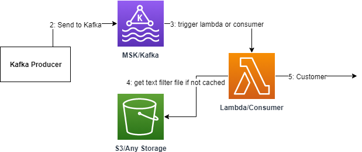
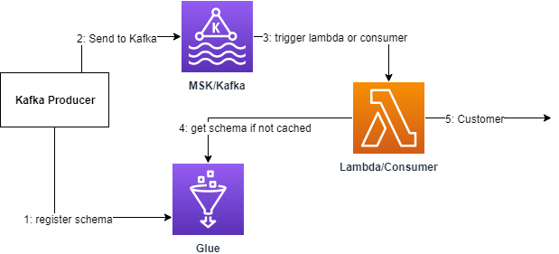
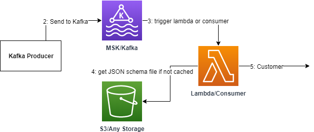

## What?

**This package contains ways to filter Kafka and AMQ**

## What is Kafka/AMQ?

**Put simply Kafka and AMQ are secure systems used to pass information**

## What does this information look like?

**The information can be anything but is usually transmitted in a popular format - such as JSON**

## Can I see a example of this?

```
{ "name"   : "John Smith",
  "sku"    : "20223",
  "price"  : 23.95,
  "shipTo" : { "name" : "Jane Smith",
               "address" : "123 Maple Street",
               "city" : "Pretendville",
               "state" : "NY",
               "zip"   : "12345" },
  "billTo" : { "name" : "John Smith",
               "address" : "123 Maple Street",
               "city" : "Pretendville",
               "state" : "NY",
               "zip"   : "12345" }
}
```

**This example shows a user purchase JSON data. A company like Amazon may pass data from a Kafka producer to  a Kafka broker. A Kafka consumer(any function that accepts a kafka event) can then format and trigger further action(like using the message in a program that schedules order shipments)**

## Okay so Kafka/AMQ is handy, but what does filtering mean?

**The code in this package accepts Kafka data and then filters it based on whether it conforms to a schema or contains certain text. We filter in a consumer(in this case AWS Lambda) - something that accepts a Kafka event and can do something else with it(like call another program)**

## Okay so whats the deal with the consumer?

**Well, the consumer is the gate to everything and anything - Kafka is one of the most popular options and once a consumer filters a Kafka event based on its message contents we can send it to another program to do... well I think you get it ANYTHING!**

## Okay enough about Kafka/AMQ how does your filtering work?

**Well we have three methods: Literal String Matching, using AWS GLUE Schema and using JSON/Schema matching. All of these methods:**

- **Filter in a Consumer Lambda**


## Filtering: Literal String Matching

**In this filtering technique a consumer accepts a Kafka Event. We then:**

- **Access a Filtering file with comma seperated text(from S3 or any storage solution)**

- **Decode Kafka Messages**

- **See if they adhere to all the comma seperated filter texts and:**

    - **If So: We allow the Kafka message to continue and the customer can do anything they want with it**

    - **If Not: Well... Nothing the message is discarded and will not be processes. *For example imagine we have a producer based on shopping check-out and one customer completes a purchase while another exits before completing. Now say this producer produces 2 message JSON styles - 1 for completed purchases and 1 for non-completed. If we are looking to have completed purchases trigger confirmations sent to warehouses we only want to filter for the completed purchase JSON style.***



## Filtering: AWS Glue Schema

**In this filtering technique a Producer specifies a Schema(format for our messages), registers this in AWS Glue(simply a place to store schemas), and then accordingly produces messages adhering to the schema. This gets sent to a Kafka broker and then us the consumer and where we(again) validate messages according to the Schema:**

- **The producer registers the schema and produces messages**

- **The Kafka consumer validates and decodes messages according to the schema**

- **Do the messages validate?:**

    - **If So: We allow the Kafka message to continue and the customer can do anything they want with it**

    - **If Not: Well... Nothing the message is discarded and will not be processes. *For example imagine we have a producer based on shopping check-out and one customer completes a purchase while another exits before completing. Now say this producer produces 2 message JSON styles - 1 for completed purchases and 1 for non-completed. If we are looking to have completed purchases trigger confirmations sent to warehouses we only want to filter for the completed purchase JSON style.***



## Filtering: JSON/Schema-based 

**In this filtering technique a consumer accepts a Kafka Event. We then:**

- **Access a Filtering file with a JSON Schema(from S3 or any storage solution)**

- **Decode Kafka Messages**

- **See if they adhere to the Schema:**

    - **If So: We allow the Kafka message to continue and the customer can do anything they want with it**

    - **If Not: Well... Nothing the message is discarded and will not be processes. *For example imagine we have a producer based on shopping check-out and one customer completes a purchase while another exits before completing. Now say this producer produces 2 message JSON styles - 1 for completed purchases and 1 for non-completed. If we are looking to have completed purchases trigger confirmations sent to warehouses we only want to filter for the completed purchase JSON style.***



## So Which is the best?:

**Well - they all work slightly different but lets try to find an answer:**

- **String Matching: is less useful than schema matching as the majority of Kafka messages are sent in a JSON or other standardized format**

- **AWS Glue Schema: we have schema matching but do we really need to force our producer to choose a schema - this means our producer must parse a schema and then the consumer must look up the schema(if not cached) from AWS Glue**

- **JSON/Schema Matching: DING-DING-DING! Here we have schema matching, we can allow our producer to produce different types of messages and simply force a consumer to filter based on a schema. Moreover we can maintain the benefits of caching(and use custom Kafka serializers) to have a efficient method of filtering Kafka**

## So is that it?

**Yes - but remember a filtering method has its uses: in some cases it might be best to have literal string matching. Also, someone else may argue that AWS Glue is their preference over JSON/Schema matching. Always look to use what is best - most efficient and easy to use. There is no wrong answer here!**