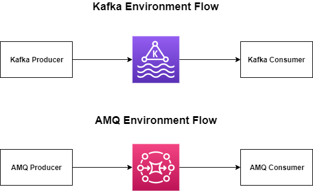
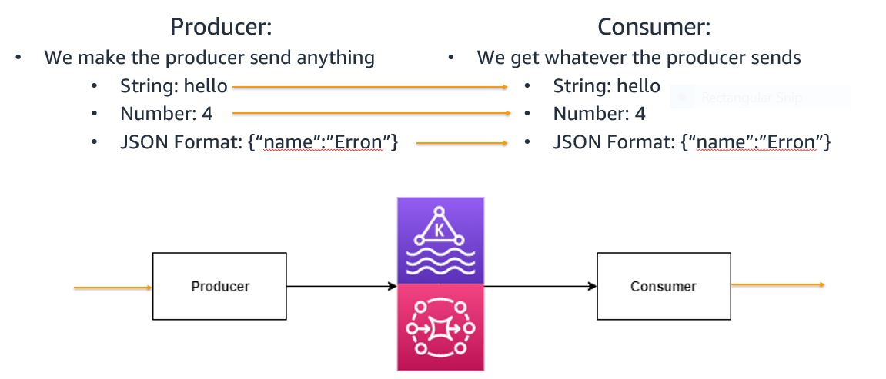
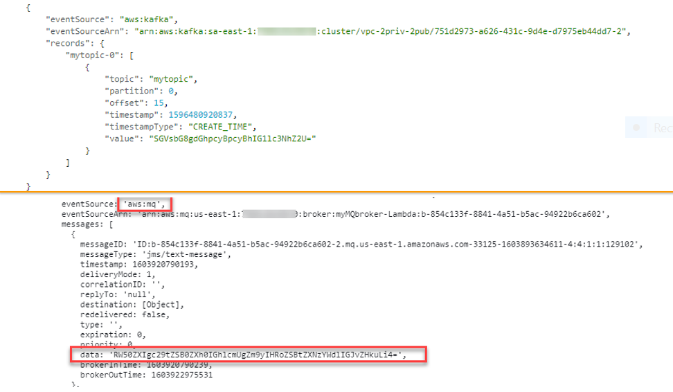
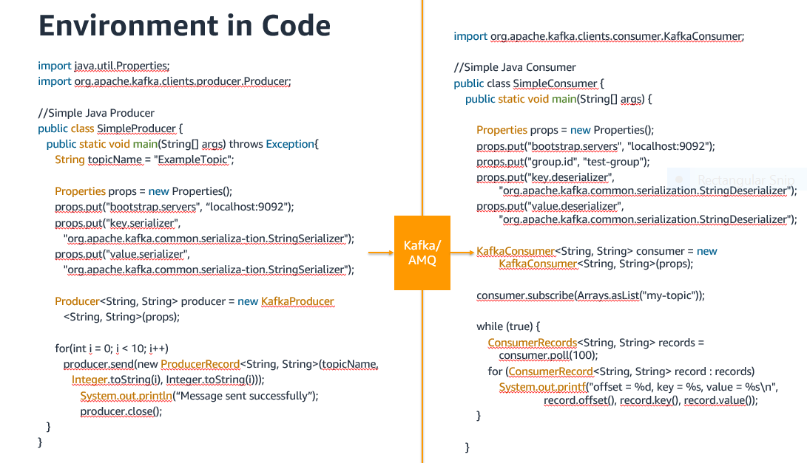

# LambdaGPFiltering

** Package Details: **

**Put simply Kafka and AMQ are secure systems used to pass information**
- Amazon MSK – Amazon Managed Kafka Service
- AMQ – Amazon Managed Message Broker Service
- Self-Managed Kafka – Self(Not Amazon) Managed Kafka Service

**What Does this Messaging-System look like?:**

**What Goes In/Out of these Messaging Systems?**

*The Consumer Gets the Message in a Formatted Event*

**What exactly does the Consumer Get?**

**Simple Producer and Consumer in Code**

**What is Filtering:**

- Filtering is done in a Consumer
- Filtering is done on the Message and/or Event-Format
     - Filtering on the Message:
        - Literal-String Filtering
        - JSON Schema Filtering
        - AWS Glue Schema Filtering
    - Filtering on the Event-Format
        - JSON Schema Filtering

# Filtering in General Poller Consumer Polling Function:

**File `./JavaIntegration/runFilter.java` is a Java file that accepts commandline input and mimics a Java Poller Consumer**
- export a valid test Kafka/AMQ event and pass it to the file:
    - `export str=\''{"eventSource":"aws:kafka","eventSourceArn":"arn:aws:kafka:us-east-1:123456789012:cluster\/vpc-3432434\/4834-3547-3455-9872-7929","bootstrapServers":"b-2.demo-cluster-1.a1bcde.c1.kafka.us-east-1.amazonaws.com:9092,b-1.demo-cluster-1.a1bcde.c1.kafka.us-east-1.amazonaws.com:9092","records":{"mytopic-01":[{"topic":"0mytopic","partition":0,"offset":15,"timestamp":1596480920837,"timestampType":"CREATE_TIME","value":"eyJmaXJzdE5hbWUiOiJCaWxsYSIsImxhc3ROYW1lIjoib25ldyIsImFnZSI6MTcsImNvbG9yIjoieWVsbG93In0=","headers":[{"headerKey":[104,101,97,100,101,114,86,97,108,117,101]}]},{"topic":"1mytopic","partition":0,"offset":15,"timestamp":1596480920837,"timestampType":"CREATE_TIME","value":"eyJmaXJzdE5hbWUiOiJCaWxsYSIsImxhc3ROYW1lIjoib25ldyIsImFnZSI6MTcsImNvbG9yIjoieWVsbG93In0=","headers":[{"headerKey":[10,101,97,100,101,114,86,97,108,117,101]}]},{"topic":"2mytopic","partition":0,"offset":15,"timestamp":1596480920837,"timestampType":"CREATE_TIME","value":"eyJmaXJzdE5hbWUiOiJCaWxsYSIsImxhc3ROYW1lIjoib25ldyIsImFnZSI6MTcsImNvbG9yIjoieWVsbG93In0=","headers":[{"headerKey":[10,101,97,100,101,114,86,97,108,117,101]}]},{"topic":"3mytopic","partition":0,"offset":15,"timestamp":1596480920837,"timestampType":"CREATE_TIME","value":"eyJmaXJzdE5hbWUiOiJCaWxsYSIsImxhc3ROYW1lIjoib25ldyIsImFnZSI6MTcsImNvbG9yIjoieWVsbG93In0=","headers":[{"headerKey":[4,101,97,100,101,114,86,97,108,117,101]}]}]}}'\'`

    - run `javac runFilter.java`
    - run `java runFilter $str`

**What is this file doing?**

**There are 3 Files that make up Filtering:**
- `messageFilter.py` - filters Kafka/AMQ messages through schema validation. Message Schema .json File pulled from the specified S3 bucket and locally cached.
- `eventFilter.py` - filters Kafka/AMQ Event Formats through schema validation. Event Schema .json File pulled from the specified S3 bucket and cached.
- `headerFilter.py` - filters Kafka/AMQ headers through schema validation. Header Schema .json File pulled from the specified S3 bucket and cached.

**Valid Schema examples can be found in file `./schemas/schema.json` or within the `./jsonschema/schema`**

**Schema Validation is carried out through:**
- Pulling a local Schema(or pull from storage if no local schema)
- Comparing input to schema
    - if we have a empty/no schema or fail to validate we reload the latest schema from storage and recheck
- Local caching is implemented through storing local files - greatly improving efficiency over continous S3/storage pulls. 
- In the case we locally cache a file and we have a failed validation we update our local cache with the latest schema from the bucket
- Caching efficiency results: 600ms(initial)->120ms(combined with all filtering)

**The file runFilter.java works by:**
- creating 2 threads - one for event-format filtering and one for message and header filtering
- starting both threads at the start of the main function(for outside use start at the beginning of the consumer)
- after ALL code but before polling(doing something with the consumed event) we:
    - first: we join both threads getting the filtered event string from message/header filtering and a exit code from event format filtering
        - if the exit code of event format filtering is 1 we poll the resultant event string from meessage/header filtering 
        - else the event is not polled(add any polling output)

**The filtering files(`messageFilter.py eventFilter.py headerFilter.py`) can be used in any environment. For use with different languages refer to the above use in `runFilter.java`**

*File `./JavaIntegration/rawMessage.py` is a sample that shows filtering Messages without AWS Formatting*

# Below: Filtering in preformed Lambda Consumer:

*This package contains 3 filtering methods to filter Kafka and AMQ payloads:*
- *Filtering VIA Literal String Matching: .../ErronPF/TextFiltering*
- *Filtering VIA AWS Glue Schema Registry: .../ErronPF/GlueSchemaFiltering*
- *Filtering VIA JSON Schema: .../ErronPF/JSONSchemaFiltering*

## An Overview of the Resources Created For EACH filtering mechanism:

- **MSK Instance**

- **AMQ ActiveMQ Broker Instance**

- **Lambda Function to filter messages**

- **S3 bucket to store a filter for JSON and Literal String filtering**

- **VPC with private and public gateways - also other neccessary features such as NAT Gateway**

- **EC2 Instances to access Kafka**

- **Neccessary Security Groups to allow traffic between above resources**

## Filtering: Literal String Matching

**To access this filtering method go to .../ErronPF/TextFiltering. There are 2 YAML files which produce slightly different filtering implementation:**

*textCache.yaml:*

- the Lambda Kafka Consumer function Caches Comma Seperated Text found from ANY source(default setup is Amazon S3) 
- when the function first starts it calls the source and recieves the text(if any. DEFAULT: filter.txt)
- the function caches this filter text for quick use for further calls
- when a payload does not contain all the filter text the function checks the source for any updated filters
- when a empty string(No File/Empty File) is cached the function checks for updated filters
- when a Cache is reset(Lambda throws .bss, .text, and .data away) the function automatically gets the lastest filters from the source
- Note: for outside cloud storage it is likely that packages need to be imported - to do this add the package via a layer and implement those functions where the default S3 functions are listed 

*textS3.yaml(optimized for Amazon S3):*

- the lambda function expects use with Amazon S3(default expects a filter file of filter.txt if any)
- add newly created or any S3 bucket as event source TWICE - once for ALL CREATE EVENTS and another for ALL DELETE EVENTS
- when first starting the function checks S3 for a filter file(default: filter.txt)
- the function caches S3 filter text 
- S3 contacts the function when a new file is added to the bucket or deleted
- once notified by S3 the function will update its cache to match the bucket modifications
- when a Cache is reset(Lambda throws .bss, .text, and .data away) the function automatically gets the lastest filters from S3

**Run either of the two Stacks and then follow the below steps for use**

**AMQ USE:**

- *1: Go to the newly Created AMQ Broker via the AMQ portal*
 
- *2: Click on the URL link that connects to the ActiveMQ portal*
 
- *3: Enter AMQ username and password - THE DEFAULT VALUES ARE FOUND IN THE YAML(Username: erronamq Password: erronamqpassword)*
 
- *4: Create a new Queue in the Queue tab*
 
- *5: Leave this window open and navigate to a Amazon CLI window - we are creating a secret key that lambda can use to access the broker with the username and password from step 3*
 
- *6: In the CLI window enter the following command replacing 'NAME' with any name for the secret key and the username and password fields with the values used in step 3 -*
 
    - *`aws secretsmanager create-secret --name 'NAME' --secret-string '{"username": "your-username", "password": "your-password"}`*
 
- *7: You can exit the CLI and navigate to the newly created lambda function*
 
- *8: Attach the AMQ Broker as a trigger using the newly created secret key and queue name from step 4 THE TRIGGER WILL TAKE A MINUTE TO ACTIVATE* 
 
- *9: Return to AMQ ActiveMQ window click on the send button in the header*
 
- *10: In queue enter the name of the queue created in step 4, type a message in the bottom text field, and alter message quantity field if wanted*
 
- *11: Once you click send lambda will proccess the message and apply any messaging filtering if you have a 'filter.txt' file in the S3 bucket created by the template*
 
- *12: Go to cloudwatch to see a output of events and message filtering*

**MSK/Kafka USE:**

- *1: Go to PUBLIC EC2 Instance 1 in EC2 portal*

- *2: Connect VIA the web terminal*

- *3: Navigate to the preinstalled 'Kafka' folder - `cd kafka`*

- *4: Enter the following command replacing arn with the MSK cluster arn -*

    - *`aws kafka describe-cluster --region us-east-1 --cluster-arn "ClusterArn"`*

- *5: Run the following command, replacing ZookeeperConnectString with the value corresponding value from step 4 output- `bin/kafka-topics.sh --create --zookeeper ZookeeperConnectString --replication-factor 3 --partitions 1 --topic ENTERANYTOPICNAMEHERE`*

- *6: Go to the lambda function and add the MSK cluster as a trigger using the topic name from step 5 - YOU DO NOT NEED A SECRET KEY*

- *7: Follow the steps in: https://docs.aws.amazon.com/msk/latest/developerguide/produce-consume.html*

- *8: You can enter messages into the first EC2 instance window and see them pop up in the second instance - they are also being accepted by lambda - OPEN CLOUDWATCH AND NAVIGATE TO THE LAMBDA FUNCTION LOG TO SEE EVENTS AND MESSAGE FILTERING*

- *add a `filter.txt` file with comma seperated text in the S3 Bucket created by the template to add filters*

**Creating a Filter file:**

**A filter file named `filter.txt` should be added in the newly created S3 bucket(or any bucket and add the event source to the function) - create a .txt file, name it 'filter'(name constraint can be changed in lambda code console) and add text seperated by commas and all messages will be passed through this filter list - if a message contains all the words the message passed**

- *No file means no filtering*

- *An empty `filter.txt` means no filtering*

- *An `filter.txt` file with "hello, Yes, NO" means messages are filtered by the words hello, yes and no - NOT CASE SENSITIVE*

## Using AWS Glue with Schema Registry

**To access this filtering method go to .../ErronPF/GlueSchemaFiltering**

- 1: Run the GlueSchemaRole.json - For Name it is recomended to Use 'MSKRole'

- 2: Run the AWSGSConnect.json - Name it MSKClient, add a existing key-pair, add the IAM role from the outputs section of GlueSchemaRole.json 'MSKRole-XXXXXXXXXXXX-XX...'

- 3: Run the AWSGSCluster.json - Name it MSK, for bastion stack put MSKClient - or any name you gave to the template in step 2 - choose Kafka version *2.70* and type 'false' for TLS Authentication

- 4: Go to Cloud9 Console and open the newly created Cloud9 Bastion instance

- 5: Connect to the newly created EC2 instance via the following commands:

    - chmod 600 <pem file>

    - eval `ssh-agent`

    - ssh-add -k <pem file>

    - export MSK_STACK=MSK

    - export ssh_cmd=$(aws cloudformation describe-stacks --stack-name $MSK_STACK --query 'Stacks[0].Outputs[?OutputKey==`SSHKafkaClientEC2Instance`].OutputValue' --output text)

    - $ssh_cmd

    - *export commands assume use of defualt template names listed above*

- 6: You are now in the EC2 instance Run the following commands to create easy export short cuts:

    - cd /tmp/kafka

    - export MSK_STACK=MSK

    - . ./setup_env $MSK_STACK

    - *If a no /.../aws directory found run: 'aws hash'*

- 7: Run the following Commands to create a topic - previous step exported MSK connections details for easy use such as $zoo below

    - cd /home/ec2-user/kafka

    - bin/kafka-topics.sh --create --zookeeper $zoo --replication-factor 3 --partitions 3 --topic ExampleTopic

**TO USE AWS GLUE SCHEMA REGISTRY FOLLOW THE STEPS 8A, 9A, 10A).TO USE A EXPLICIT SCHEMA AND REGISTRY(PROVIDED IN THE EXAMPLE) FOLLOW STEPS 8B, 9B, 10B**

- 8A: For the producer to connect to the MSK client run the following commands to add Bootstrap Server Strings and Schema Registry DNS Entry FOR AUTO REGISTRATION. 

    - `cd /tmp/kafka`

    - `export MSK_STACK=MSK`

    - create `producer.properties_msk` if not seen when using ls - put in `BOOTSTRAP_SERVERS_CONFIG=`

    - `sed -i -e "s/BOOTSTRAP_SERVERS_CONFIG=/BOOTSTRAP_SERVERS_CONFIG=$brokers/g" producer.properties_msk`

- 8B: For the producer to connect to the MSK client run the following commands to add Bootstrap Server Strings and Schema Registry DNS Entry FOR EXPLICIT SCHEMA. 

    - `cd /tmp/kafka`

    - make file `schema-registry.properties`

    - put the following text in it: `kafkastore.bootstrap.servers=`

    - run the following two commands: `sudo systemctl start confluent-schema-registry` then `sudo systemctl status confluent-schema-registry`

    - check confluent has started `cat /tmp/kafka/schema-registry.log|grep "Server started"`

    - run `export MSK_STACK=MSK`

    - create `producer.properties_msk` if not seen when using ls - put in `BOOTSTRAP_SERVERS_CONFIG=` and below `SCHEMA_REGISTRY_URL_CONFIG=`

    - run `sed -i -e "s/BOOTSTRAP_SERVERS_CONFIG=/BOOTSTRAP_SERVERS_CONFIG=$brokers/g" producer.properties_msk`

    - run `sed -i -e "s/SCHEMA_REGISTRY_URL_CONFIG=/SCHEMA_REGISTRY_URL_CONFIG=$SCHEMA_REGISTRY_URL/g" producer.properties_msk`  

- 9A: Start the producer:

    - export region=$(curl http://169.254.169.254/latest/meta-data/placement/region)

    - export schema_compatibility=FULL_ALL

    - java -jar KafkaClickstreamClient-1.0-SNAPSHOT.jar -t ExampleTopic -pfp /tmp/kafka/producer.properties_msk -nt 8 -rf 10800 -nle -gsr -gsrr $region -gar -gcs $schema_compatibility > /tmp/producer.log 2>&1 &

    - This command shows proper function of producer: 'tail -f /tmp/producer.log' *ctrl-c to exit log*

- 9B: Start the producer:

    - run `java -jar KafkaClickstreamClient-1.0-SNAPSHOT.jar -t ExampleTopic -pfp /tmp/kafka/producer.properties_msk -nt 8 -rf 10800 -nle > /tmp/producer.log 2>&1 &`

    - This command shows the producer is properly producing: `tail -f /tmp/producer.log` *ctrl-c to exit log*

- 10A: Schema has been registered - you can go to AWS Glue Console under Schema Registry and Schemas and see - Now create Lambda:

    - `cd /tmp/kafka`

    - `git clone https://github.com/errona1/ErronGlue.git`

    - `cd ErronGlue`

    - `export MSK_STACK=MSK`

    - `export KAFKA_CLIENT_STACK=MSKClient`

    - `export VPC_STACK=$(aws cloudformation describe-stacks --stack-name $MSK_STACK --query 'Stacks[0].Outputs[?OutputKey==`VPCStackName`].OutputValue' --output text)`

    - `export SECONDARY_DESERIALIZER=false`

    - `export CSR=false`

    - `./deploy.sh $VPC_STACK $KAFKA_CLIENT_STACK $MSK_STACK $SECONDARY_DESERIALIZER $CSR`

- 10B: Schema has been registered - Now create Lambda:

    - `cd /tmp/kafka`

    - `git clone https://github.com/errona1/ErronGlue.git`

    - `cd ErronGlue`

    - `export MSK_STACK=MSK`

    - `export KAFKA_CLIENT_STACK=MSKClient`

    - `export VPC_STACK=$(aws cloudformation describe-stacks --stack-name $MSK_STACK --query 'Stacks[0].Outputs[?OutputKey==`VPCStackName`].OutputValue' --output text)`

    - `export SECONDARY_DESERIALIZER=false`

    - `export CSR=true`

    - `./deploy.sh $VPC_STACK $KAFKA_CLIENT_STACK $MSK_STACK $SECONDARY_DESERIALIZER $CSR`

- 11: Lambda has been Created Check Lambda portal - Producer Runs for 30 minutes to rerun repeat step 9 - Cloudwatch will show incoming MSK events which are being pushed to a s3 storage via firehose for easy record access

- 12: Go to the Kinesis Firehose portal find newly created stream, click on s3 output to be redirected to s3, open folders until you reach s3 files and perform query with s3 to see data from the producer

*The Producer validates records by Schema and the Lambda decodes records using the Schema The schema can be found in this git repository under erronS/main/resources/avro*

**Any new producer can be added but must be properly configured - new schemas can be added to the computer and will be referenced by localHost:8081/PATHTOSCHEMA in Schema URL. Auto Registration will create new Schemas in  a registry based upon producer format**

## Filtering: JSON Schema

**To access this filtering method go to .../ErronPF/JSONSchemaFiltering. There are 2 YAML files which produce slightly different filtering implementation:**

*jsonCache.yaml:*

- the Lambda Kafka Consumer function Caches JSON Schema found from ANY source(default setup is Amazon S3) 
- when the function first starts it calls the source and recieves any schema(if any. DEFAULT: schema.json)
- the function caches this schema for quick use for further calls
- when a payload does not validate against the schema the function checks the source for an updated schema
- when a empty schema(No File/{}) is cached the function checks for an updated schema
- when a Cache is reset(Lambda throws .bss, .text, and .data away) the function automatically gets the lastest schema from the source
- Note: for outside cloud storage it is likely that packages need to be imported - to do this add the package via a layer and implement those functions where the default S3 functions are listed 

*jsonSchemaS3.yaml(optimized for Amazon S3):*

- the lambda function expects use with Amazon S3(default expects a schema file of schema.json if any)
- add newly created or any S3 bucket as event source TWICE - once for ALL CREATE EVENTS and another for ALL DELETE EVENTS
- when first starting the function checks S3 for a schema file(default: schema.json)
- the function caches S3 schema - invalid JSON is stored as `None` 
- S3 contacts the function when a new file is added to the bucket or deleted
- once notified by S3 the function will update its cache to match the bucket modifications
- when a Cache is reset(Lambda throws .bss, .text, and .data away) the function automatically gets the lastest schema from S3

**Run either of the two Stacks and then follow the below steps for use**

**AMQ USE:**

- *1: Go to the newly Created AMQ Broker via the AMQ portal*
 
- *2: Click on the URL link that connects to the ActiveMQ portal*
 
- *3: Enter AMQ username and password - THE DEFAULT VALUES ARE FOUND IN THE YAML(Username: erronamq Password: erronamqpassword)*
 
- *4: Create a new Queue in the Queue tab*
 
- *5: Leave this window open and navigate to a Amazon CLI window - we are creating a secret key that lambda can use to access the broker with the username and password from step 3*
 
- *6: In the CLI window enter the following command replacing 'NAME' with any name for the secret key and the username and password fields with the values used in step 3 -*
 
    - *aws secretsmanager create-secret --name 'NAME' --secret-string '{"username": "your-username", "password": "your-password"}'*
 
- *7: You can exit the CLI and navigate to the newly created lambda function*
 
- *8: Attach the AMQ Broker as a trigger using the newly created secret key and queue name from step 4 THE TRIGGER WILL TAKE A MINUTE TO ACTIVATE* 
 
- *9: Return to AMQ ActiveMQ window click on the send button in the header*
 
- *10: In queue enter the name of the queue created in step 4, type a json message in the bottom text field, and alter message quantity field if wanted(example: `{"firstName":"Johanessvar"}`)*
 
- *11: Once you click send lambda will proccess the message and validate it according to any existing schema 'schema.json' file in the S3 bucket created by the template*
 
- *12: Go to cloudwatch to see a output of events and message filtering*

**MSK/Kafka USE:**

- *1: Go to PUBLIC EC2 Instance 1 in EC2 portal*

- *2: Connect VIA the web terminal*

- *3: Navigate to the preinstalled 'Kafka' folder - `cd kafka`*

- *4: Enter the following command replacing arn with the MSK cluster arn -*

    - *`aws kafka describe-cluster --region us-east-1 --cluster-arn "ClusterArn"`*

- *5: Run the following command, replacing ZookeeperConnectString with the value corresponding value from step 4 output- `bin/kafka-topics.sh --create --zookeeper ZookeeperConnectString --replication-factor 3 --partitions 1 --topic ENTERANYTOPICNAMEHERE`*

- *6: Go to the lambda function and add the MSK cluster as a trigger using the topic name from step 5 - YOU DO NOT NEED A SECRET KEY*

- *7: Follow the steps in: https://docs.aws.amazon.com/msk/latest/developerguide/produce-consume.html*

- *8: You can enter JSON messages into the first EC2 instance window and see them pop up in the second instance - they are also being accepted by lambda - OPEN CLOUDWATCH AND NAVIGATE TO THE LAMBDA FUNCTION LOG TO SEE EVENTS AND MESSAGE FILTERING*

- *add a `schema.json` file in the S3 Bucket created by the template to add schema filter*

**Creating a Schema file:**

**A schema file named `schema.json` should be added in the newly created S3 bucket(or any bucket and add the event source to the function) - create a .json file, name it 'schema'(name constraint can be changed in lambda code console) and add JSON**

- *No file means no filtering*

- *An empty `schema.json` file means no filtering*

- *see `exampleSchema.json` file for example of a valid JSON Schema - the schema does not need to follow this format BUT MUST BE VALID JSON OR IT WILL BE SKIPPED*

## Documentation

* Using Live Version Set *
Generated documentation for the latest released version can be accessed here:
https://devcentral.amazon.com/ac/brazil/package-master/package/go/documentation?name=ErronPF&interface=1.0&versionSet=live

